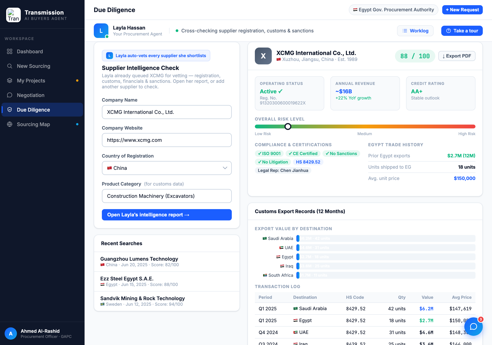
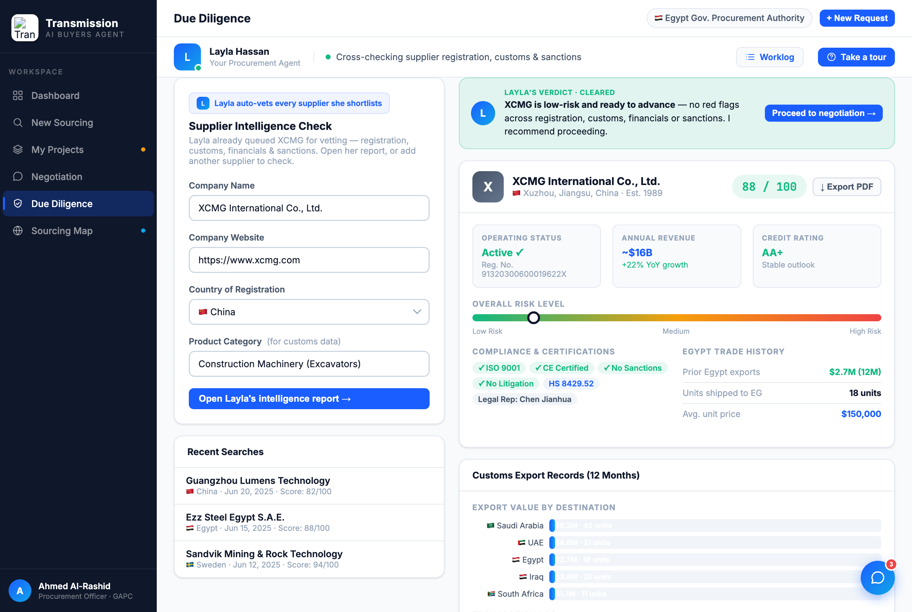

# Round 056 · 🟦 Standard · Diligence 报告「Layla's verdict」结论横幅(§3-E/§4)· 自主模式

- 时间:2026-06-26 · 档位:🟦 Standard · backlog 来源:审计 diligence 报告 —— 数据丰富(评分/风险表/合规/海关图)但**无顶部结论+下一步**,买方需自己读表判断(违 §3-E 助理给结论 / §4 明确下一步)
- **做了什么**:`#dd-report` 顶部新增**「Layla's verdict · Cleared」绿结论横幅**:Layla 头像 + 结论(「XCMG 低风险、可推进 —— 注册/海关/财务/制裁四维 0 红旗,建议推进」)+「Proceed to negotiation →」决策按钮。与 procurement R044 决策横幅同款,全视图一致「结论→决策」。
- **验收**:console 零错 ✓ · 强显 dd-report 截图确认绿结论横幅在数据卡之上 + Proceed 按钮 ✓ · 纯静态 additive、diligence-only、无逻辑改动、无回归 ✓ · 3/3 KEEP(产品:报告先给结论+下一步非裸数据,跨视图一致;视觉:绿 cleared 横幅+Layla 头像无 emoji;回归:console 零错)。
- **截图**: 
- **残留 → backlog**:决策卡抽组件(dashboard/proc/diligence 三处 verdict 横幅可归一);功能性国旗(低优先)。
- commit:见 git(cp index.html + push)
