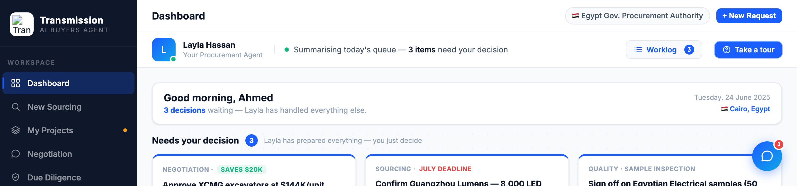

# Round 057 · ⬜ Polish · agent-bar Worklog 新活动徽章(人感+发现性)· 自主模式

- 时间:2026-06-26 · 档位:⬜ Polish · backlog 来源:审计 Worklog —— 面板写「3 new」但 agent-bar 的 Worklog 按钮无提示,既弱化「Layla 在替你干活」人感,也降低 worklog 功能发现性
- **审计**:打开 Worklog 面板核查 —— 时间戳动作流 + 决策链接 + 语义点,内容强,无需改。仅入口缺新活动提示。
- **做了什么**:agent-bar「Worklog」按钮加 accent 蓝 mono **「3」徽章**(与面板「3 new」一致),点击打开 worklog 时徽章清除(`toggleRobot` 打开分支隐藏)。标准通知 UX。
- **诚实**:3 = 面板真实 new 条数,非凭空。
- **验收**:console 零错 ✓ · BADGE_BEFORE=flex / AFTER_OPEN=none(打开即清)+ 截图确认蓝「3」徽章 ✓ · additive、无逻辑影响、无回归 ✓ · 3/3 KEEP(产品:新活动提示+人感+发现性;视觉:小 accent mono 徽章在调色板内;回归:console 零错清除正常)。
- **截图**:
- **残留 → backlog**:决策卡抽组件;功能性国旗(低优先)。
- commit:见 git(cp index.html + push)
