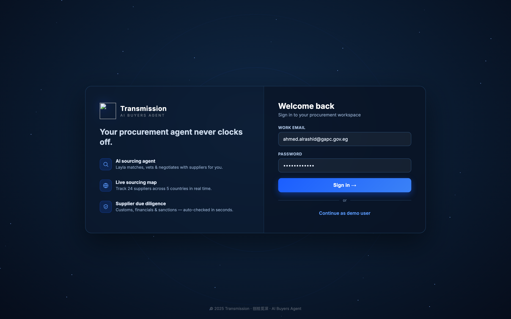
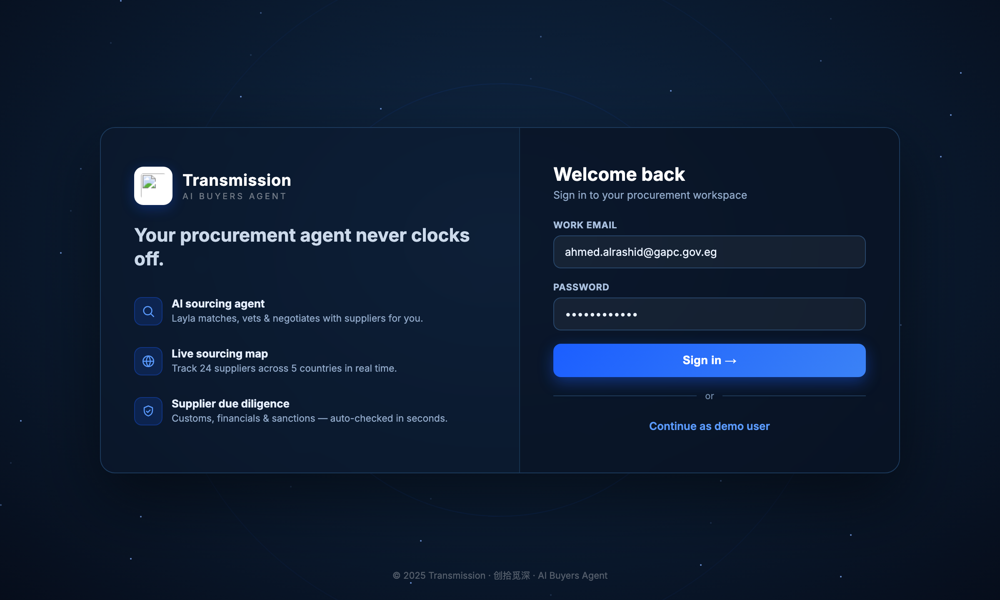

# Round 058 · ⬜ Polish · 登录页 logo 白 chip(开场对比修复)· 自主模式

- 时间:2026-06-26 · 档位:⬜ Polish · backlog 来源:用户多轮点名「开场」+ 审计 login(R035)发现品牌 logo 在深色卡上**发淡/糊**
- **审计**:login 整体强(深色玻璃双栏 + 星空 + 价值主张 + 3 feature + demo 入口)。唯一瑕疵:`.lg-logo img`(`transmission-tm-icon.svg`)只有蓝光晕、**无白底 chip** —— monogram 的深 navy T 笔画并入深色卡 → 发淡像残缺(同 R001 侧栏曾遇的暗底对比问题)。用的是真 SVG logo(非占位),无红线违规,纯对比问题。
- **做了什么**:`.lg-logo img` 加 **白底圆角 chip**(46px box-border + 8px padding + 蓝光 shadow + inset 描边),与侧栏 `.brand-icon`(R001)一致 —— 完整 monogram 在白底清晰可见。
- **验收**:console 零错(无 SVG 404)✓ · before/after 截图:logo 由暗淡方块 → 清晰白 chip monogram ✓ · 纯 CSS、login-only、无逻辑/回归 ✓ · 3/3 KEEP(产品:开场首印象 logo 清晰;视觉:白 chip+蓝光与侧栏一致高级;回归:console 零错)。
- **截图**: 
- **残留 → backlog**:决策卡抽组件;功能性国旗(低优先)。
- commit:见 git(cp index.html + push)
