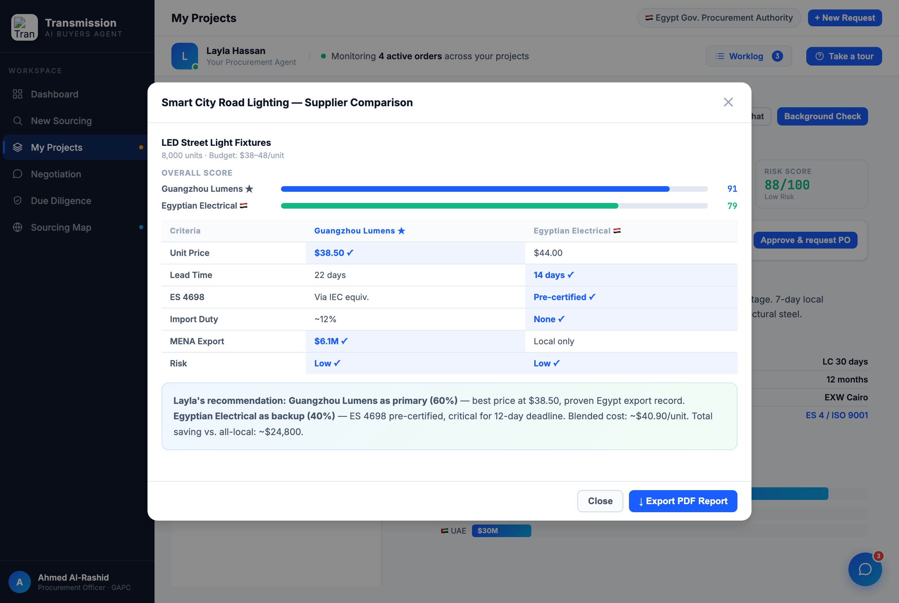

# Round 060 · ⬜ 审计+Polish · Compare 模态核验(强)+ persona 统一为 Layla · 自主模式

- 时间:2026-06-26 · 档位:✅ 审计 + ⬜ Polish · backlog 来源:核查「Compare All Suppliers」路径 + persona 一致性
- **审计(Compare 模态 = 强)**:procurement「Compare All Suppliers in This Project」/ dashboard「Compare」→ `openCompare` 开 Supplier Comparison Report:**OVERALL SCORE 双条形**(Guangzhou 91 vs Egyptian 79)+ **逐维度对比表带每行 winner ✓**(单价/交期/ES4698/进口税/MENA出口/风险)+ Layla 配比建议(主 60%/备 40%、blended cost、省 ~$24,800)。优秀 §3-E 组件,无缺陷。
- **做了什么(persona 修)**:compare 推荐框 `Specialist recommendation:` → **`Layla's recommendation:`**(R015 已统一 persona,此处为残留)。**全量 sweep**:`AI specialist / your agent / specialist suggests` 等残留 = **0**(仅保留「Your Procurement Agent」Layla 身份)。现「Layla's recommendation」3 处(compare/proc R044/diligence R056)跨视图一致。
- **验收**:console 零错 ✓ · 长 reveal 截图确认推荐框「Layla's recommendation」+ 对比表/score 条完好 ✓ · 残留 persona sweep=0 · 纯文案、无回归 ✓ · 3/3 KEEP。
- **截图**: 
- **残留 → backlog**:决策卡抽组件;功能性国旗(低优先)。
- commit:见 git(cp index.html + push)
