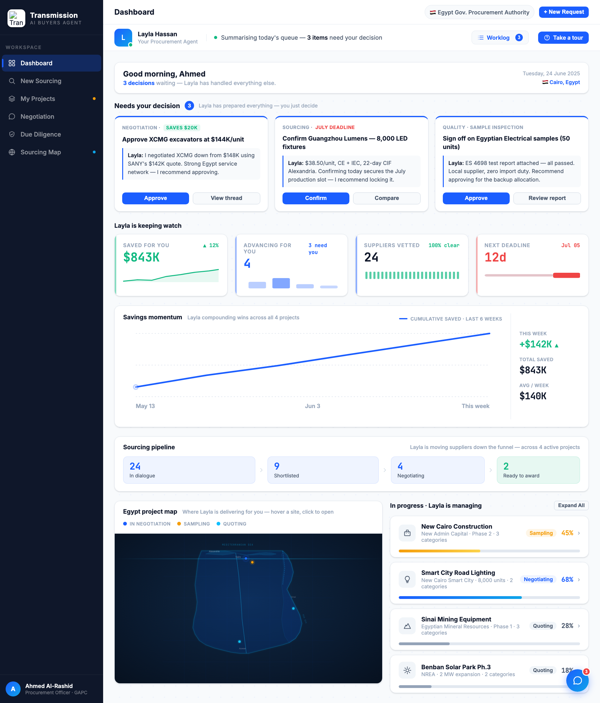
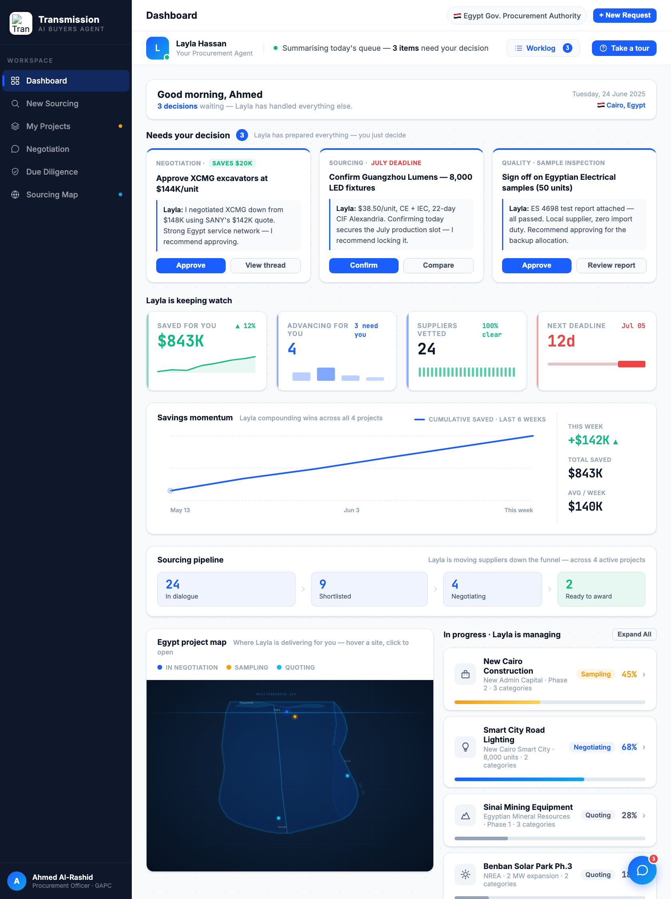

# Round 061 · ✅ 审计 · 笔记本宽度响应式核验(1280/1120,无回归)· 自主模式

- 时间:2026-06-26 · 档位:✅ 审计(无代码改动)· backlog 来源:R047 重组 + R036-060 大量新增 2-col/组件后,常见笔记本宽度未复核(R027 仅查过改前的 1280/1366)
- **审计**:1280 + 1120 宽度逐视图核验我所有新增是否破版:
  - **dashboard**(1280 & 1120):3 决策卡 / grid-4 KPI / Savings momentum / Sourcing pipeline / **Egypt map | In progress 2-col(R047)** / Replies|Deadlines 2-col —— 全部优雅压缩,无破版、无溢出。
  - **negotiation**(1280):3 列(供应商列表 | 聊天线程+决策面板/压价 sparkline | Supplier Profile)完整。
  - **procurement**(1280):树 | briefing(决策横幅 R044 / 阶段追踪 R041 / score 徽章 R049 / export 条)完整。
- **结论**:R036-060 全部新增(含结构性重组 R047)在 1280/1120 **稳健无回归**。demo 适配常见笔记本展示屏。
- **验收**:逐视图截图肉眼核验无破版 · 纯审计无改动 · 3/3 KEEP(稳健性保障价值,无肉眼提升)。
- **截图**: 
- **残留 → backlog**:决策卡抽组件(纯重构无视觉);功能性国旗(低优先)。**demo 高质量稳健态。**
- commit:仅 reports(无 HTML 改动)
