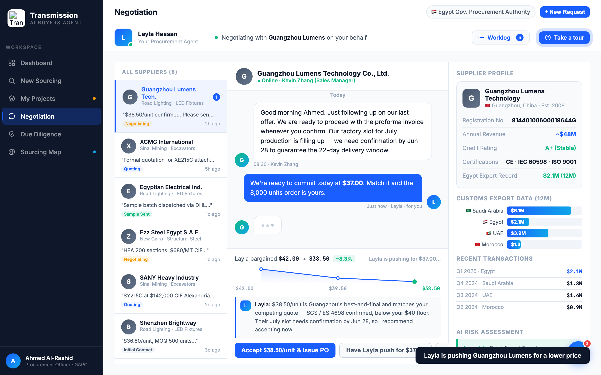

# Round 062 · 🟦 Standard · Negotiation 供应商「typing…」指示器(§3-D 人感)· 自主模式

- 时间:2026-06-26 · 档位:🟦 Standard · backlog 来源:factorygate `typingBounce`(我没有)+ §3-D 看得见来回博弈
- **做了什么**:`negDecide('push')` 后供应商 counter 到达前的延迟里,聊天线程显示**供应商「正在输入」气泡**(3 点弹跳 typing 指示器,供应商头像侧);counter 真消息到达时移除该气泡。延迟 1000→1200ms 让 typing 更可见。新增 `.typing-dots` + `typingBounce` keyframe(reduced-motion 关)+ `negTyping(ava)`。
- **诚实**:typing 后**必跟真实 counter 消息**(非永续假 spinner),代表真实将到的回复 —— 与红线「假装思考空转」不同。
- **验收**:console 零错 ✓ · MID_TYPING=true / AFTER_TYPING=false / IN_MSGS=5(counter 已加)+ 截图确认延迟中供应商 typing 气泡 ✓ · 仅 negotiation、push 路径 · 每次 push 自建自删 typing · 无回归 ✓ · 3/3 KEEP(产品:谈判像真实来回;视觉:克制 3 点 typing 标准聊天件 reduced-motion 安全;回归:console 零错 typing 正确清除)。
- **截图**:
- **残留 → backlog**:决策卡抽组件;功能性国旗(低优先)。
- commit:见 git(cp index.html + push)
