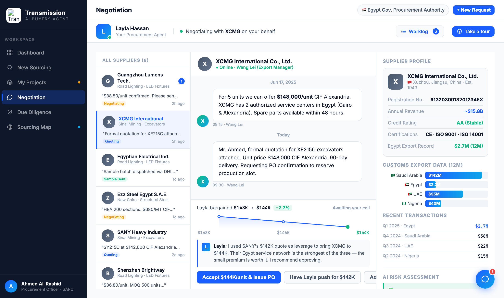

# Round 063 · 🟦 Standard · Dashboard 回复卡深链到对应供应商线程(§4)· 自主模式

- 时间:2026-06-26 · 档位:🟦 Standard · backlog 来源:审计发现 dashboard「Replies Layla is handling」3 卡全 `onclick="showView('negotiation')"`(泛跳),点 XCMG/Egyptian 卡却落到默认 Guangzhou 线程 = 错配
- **做了什么**:新增 `goNeg(id)`(showView('negotiation') + 按 onclick 匹配定位 neg-sup-item → selectNegSupplier)。3 卡 onclick 改深链:Guangzhou→`goNeg('gz')` / XCMG→`goNeg('xcmg')` / Egyptian Electrical→`goNeg('eei')`。点哪个供应商的回复就开哪个的线程。
- **验收**:console 零错 ✓ · 三链全对:`gz:OK/curNeg=gz | xcmg:OK/curNeg=xcmg | eei:OK/curNeg=eei`(active item + curNeg 均正确)+ 截图确认点 XCMG 卡 → XCMG 线程/决策/profile/agent-bar 全 XCMG ✓ · 仅 dashboard+negotiation 无回归 ✓ · 3/3 KEEP(产品:落到预期线程零困惑 §4;视觉:行为修复;回归:console 零错三链验证)。
- **截图**:
- **残留 → backlog**:决策卡抽组件;功能性国旗(低优先)。
- commit:见 git(cp index.html + push)
