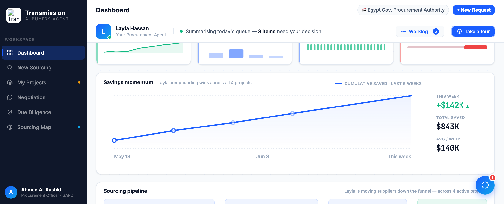

# Round 067 · 🟦 Standard · Savings momentum 加 Y 轴刻度标(可读化)· 自主模式

- 时间:2026-06-26 · 档位:🟦 Standard · backlog 来源:近看 momentum 图(R036)—— 3 条网格线**无数值标**,装饰无意义,读不出量级
- **做了什么**:momentum 图左侧加 3 个 Y 轴刻度标(`.mom-yl` mono 8px muted):顶 `$843K` / 中 `$420K` / 底 `$0`,对齐既有网格线 y=14/64/114。网格线从此有意义,累计省下量级一眼可读。
- **放置验证**:折线由左下(20,98.8)升到右上(580,14),左侧上半区为空,故左缘刻度标**不压折线**(经截图实证,非臆测)。
- **验收**:console 零错 ✓ · 截图确认 3 刻度标清晰不压线、不 cramped ✓ · 仅 3 静态 text、dashboard-only、无回归 ✓ · 3/3 KEEP(产品:图可读化量化轨迹;视觉:克制 mono 标无 slop;回归:console 零错)。
- **截图**: 
- **残留 → backlog**:决策卡抽组件;功能性国旗(低优先)。
- commit:见 git(cp index.html + push)
