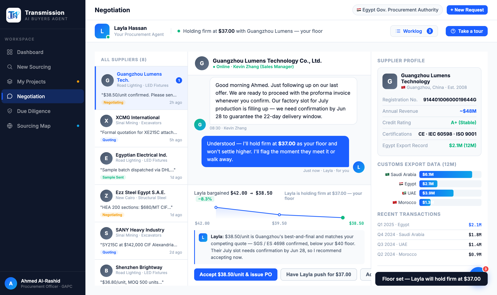

# Round 070 · 🟦 Standard · Negotiation「Adjust floor」由弱 toast → 真实在场动作(§4 去死路)· 自主模式

- 时间:2026-06-26 · 档位:🟦 Standard · backlog 来源:审计三个谈判动作 —— Accept/Push 真在场动作,**Adjust floor 仅 toast 重定向(近死路)**,违 §4「绝不留死路 / 每步都有意义」
- **审计副产**:sourcing Full Report(sr-cover stats + 分段 magazine 报告)+ sup-match-card(hover/selected 态全)均优秀,无改;入场 logo 从 demo 目录截图渲染正常(续 R069 方法)。
- **做了什么**:`negDecide('floor')` 由 `showToast('去 brief 设底线…')` → **真实在场动作**:Layla 发线程消息「Understood — 我会守住 $X 底线不松口,他们一答应/退出我立刻告诉你」+ 决策面板 & agent-bar 状态「Layla is holding firm at $X — your floor」+ toast。与 Accept/Push 一致,买方拍「守底线」即见 Layla 行动。
- **验收**:console 零错 ✓ · 真点击:out-msgs 2→3(新增 Layla 消息)+ status「Layla is holding firm at $37.00 — your floor」+ 截图确认线程消息/状态/toast ✓ · 仅 negotiation floor 分支、无回归 ✓ · 3/3 KEEP(产品:弱 toast→真在场动作去死路 §4;视觉:复用消息/状态样式;回归:console 零错验证)。
- **截图**:
- **残留 → backlog**:决策卡抽组件;功能性国旗(低优先)。
- commit:见 git(cp index.html + push)
