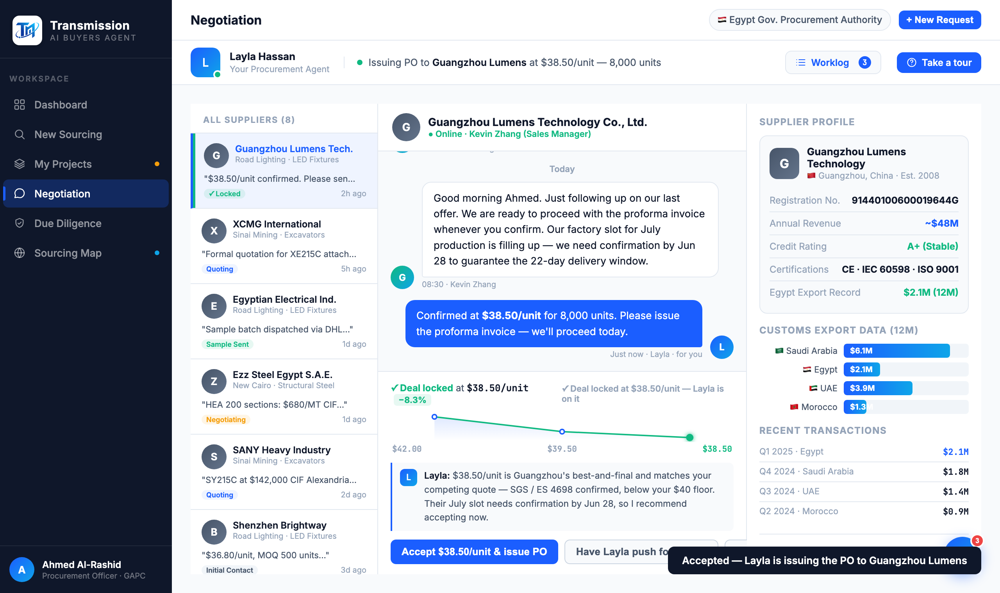

# Round 078 · 🟦 Standard · Accept 后供应商列表项同步「✓ Locked」(状态一致)· 自主模式 · 恢复 1min

- 时间:2026-06-26 · 档位:🟦 Standard · backlog 来源:用户重发 1min 恢复高频(如 R051);审计 negDecide('accept') 状态一致性
- **cadence**:用户**第二次**显式重发 1min(R051 后又 R078)→ 删 30min cron `644304d8`,恢复 1min `de3a705a`。**不再主推收敛**(用户两次明确选 1min)。
- **审计**:`negDecide('accept')` 更新 thread/status/agent-bar/trail/sparkline(锁定),但**左侧供应商列表项不变**(仍显原状态徽章)—— 锁了单但列表不反映,状态不一致。
- **做了什么**:accept 时给当前 active `.neg-sup-item` 加 `.neg-locked`(绿色左 inset border)+ 状态徽章改绿「✓ Locked」+ 隐藏 unread 计数。列表项与 thread/面板/sparkline 一致反映成交。
- **验收**:console 零错(ERR=0)✓ · LOCKEDITEM=true / BADGE「✓ Locked」+ 截图确认 Guangzhou 项绿徽章+绿左边 ✓ · 列表项静态、切换供应商持久 · 仅 negotiation accept · 无回归 ✓ · 3/3 KEEP。
- **截图**:
- **残留 → backlog**:决策卡抽组件;功能性国旗(低优先)。
- commit:见 git(cp index.html + push)
