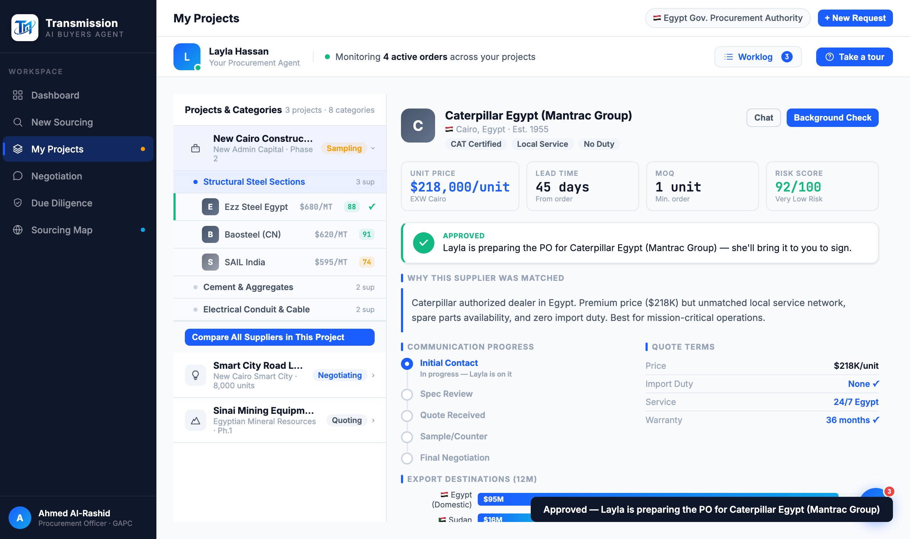

# Round 079 · 🟦 Standard · 修 cat/suez 行高亮 bug + procApprove 树项「✓ Approved」状态一致 · 自主模式

- 时间:2026-06-26 · 档位:🟦 Standard · backlog 来源:续 R078 状态一致审计(procApprove)
- **审计**:procApprove 翻 banner 但**不更新左树项**(同 R078 缺口)。实现时发现**潜在 bug**:`selectSupplier('caterpillar')` 查 `#smr-caterpillar` 但行 id 是 `smr-cat`(R050 短 id 不匹配)→ 点 Caterpillar/Suez Cement **briefing 更新但行不高亮**(active 丢失)。
- **做了什么**:
  1. **修 bug**:`selectSupplier` 行查找改稳健(先 `#smr-<id>`,失败再按 onclick 实参匹配)→ Caterpillar/Suez Cement 点击正确高亮行。
  2. **状态一致**:`procApprove` 给当前 active `.sup-mini-row` 加 `.sup-approved`(绿左 inset border)+ 末尾绿「✓」tick。批准供应商后树项反映,与 banner/R078 一致。
- **验收**:console 零错(ERR=0)✓ · catRowActive=true / suezRowActive=true(bug 修复)· ezz/cat 批准后 sup-approved=true · 截图确认 Ezz 行绿✓+绿左边 ✓ · robust 查找(id 或 onclick)· 仅 procurement · 无回归 ✓ · 3/3 KEEP。
- **截图**:
- **残留 → backlog**:决策卡抽组件;功能性国旗(低优先)。
- commit:见 git(cp index.html + push)
