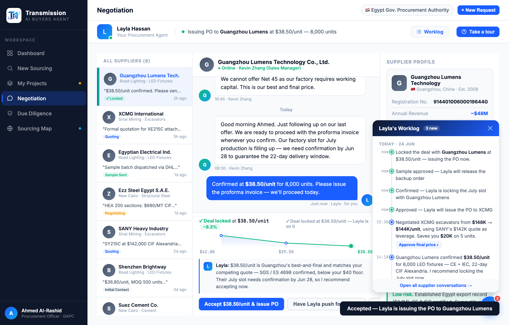

# Round 080 · 🟦 Standard · Worklog 变活:动作后追加实时条目(§3-B 可累积)· 自主模式

- 时间:2026-06-26 · 档位:🟦 Standard · backlog 来源:续状态一致审计 —— Worklog 是静态快照,违 §3-B「可累积、可回看」
- **审计**:Worklog 面板原为静态 6 条(Today/Yesterday)。批准决策 / accept 成交 / approve PO 等动作**不写入 worklog** —— 不像真实"实时动作流"。
- **做了什么**:新增 `addWorklogEntry(text)`(在 Today 组顶部插入「now · <绿点> · 文本」条目)。接入 3 个关键"Layla 行动"时刻:
  - negDecide('accept') → 「Locked the deal with <firm> at <price> — issuing the PO now.」
  - procApprove → 「Approved <name> — preparing the PO for your signature.」
  - decApprove → 该决策卡的 msg。
  - wl-time 用「now」(34px 窄,"Just now"会溢出)。
- **效果**:每次拍板,Worklog 顶部即长出带时间戳的新条目 —— worklog 成**活记录**,随操作累积(§3-B 人感)。配 R078(列表 Locked)/R079(树 Approved)状态全一致。
- **验收**:console 零错(ERR=0)✓ · 批 3 决策 + accept → wl-item 6→10、顶部「now · Locked the deal with Guangzhou…」✓ · 截图确认 4 新条目在原 log 之上 · 仅新增、无回归 ✓ · 3/3 KEEP。
- **截图**:
- **残留 → backlog**:决策卡抽组件;功能性国旗(低优先)。
- commit:见 git(cp index.html + push)
