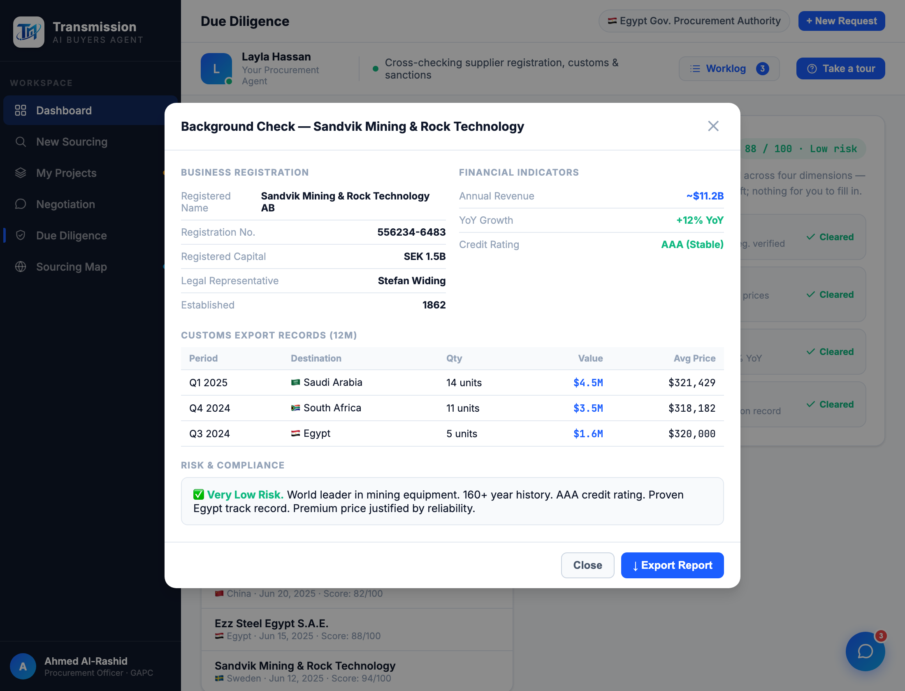

# Round 083 · 🟦 Standard · Diligence Recent Searches 修错配(开正确公司报告)· 自主模式

- 时间:2026-06-26 · 档位:🟦 Standard · backlog 来源:审计 diligence Recent Searches 点击行为
- **审计**:Recent Searches(Guangzhou/Ezz/Sandvik)onclick=`loadDDPreset(id)` —— **仅填表单**,而主 dd-report 硬编码 XCMG。点 Sandvik → 表单填 Sandvik 但「Open report」仍出 XCMG = **错配「像坏了」**。BG_DATA 有 guangzhou/ezz/sandvik/xcmg 的**动态数据**。
- **做了什么**:3 行 onclick 由 `loadDDPreset('gz'/'ezz'/'sandvik')` → `openBgCheck('guangzhou'/'ezz'/'sandvik')`(注:preset 用 'gz' 但 BG_DATA 键是 'guangzhou')。点最近搜索 → 开**该公司正确的动态背调报告**(注册/财务/海关/风险全对)。
- **验收**:console 零错(ERR=0)✓ · 三项 title 正确:Guangzhou/Ezz/Sandvik(非 XCMG)✓ · 截图确认 Sandvik 报告满数据(Reg 556234-6483 / SEK 1.5B / Stefan Widing / 1862 / ~$11.2B / AAA / 海关 Saudi/South Africa/Egypt / Very Low Risk)✓ · 仅 diligence · 无回归 ✓ · 3/3 KEEP(产品:错配修复,最近搜索真能用;视觉:既有动态 bg-modal;回归:console 零错三项正确)。
- **截图**:
- **残留 → backlog**:loadDDPreset 现无引用(无害保留);主 dd-report 仍 XCMG(表单=queued XCMG,语义正确);决策卡抽组件。
- commit:见 git(cp index.html + push)
