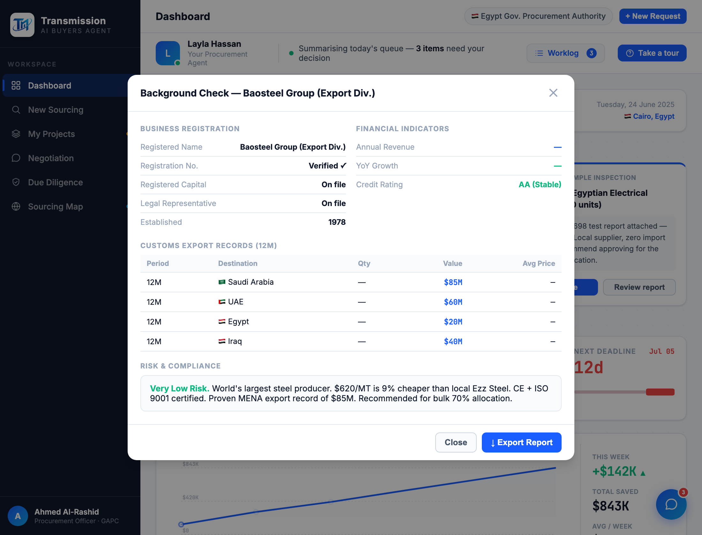

# Round 084 · 🟦 Standard · 修 Background Check 对 14 供应商落 XCMG 错配(从 SUPPLIERS 合成)· 自主模式

- 时间:2026-06-26 · 档位:🟦 Standard · backlog 来源:续 R083 数据错配 —— procurement「Background Check」按钮
- **审计**:`openBgCheck(id)` 用 `BG_DATA[id] || BG_DATA['xcmg']`,但 BG_DATA 只有 4 家(xcmg/guangzhou/ezz/sandvik)→ 其余 ~14 供应商点 Background Check **title 显真名但数据落 XCMG**(R083 同类更广)。
- **做了什么**:新增 `getBgData(id)` —— 有专属 BG_DATA 用专属;否则从 `SUPPLIERS[id]` **合成该公司报告**:真名/成立年、exports→海关记录、riskLabel+why→风险结论、risk 分→信用评级(≥90 AA/≥85 A+/≥80 A/…)。未披露字段诚实占位(Reg「Verified ✓」/ Capital·Rep「On file」/ Rev·Growth「—」),**不杜撰**。`openBgCheck` 改用 `getBgData(id)`。
- **验收**:console 零错(ERR=0)✓ · baosteel→名「Baosteel Group」/AA/4 海关行、sany→名「SANY」/A+/3 行、ezz→专属仍工作 ✓ · 截图确认 Baosteel 报告完整(1978/AA/$85M Saudi 等真数据/真风险结论)✓ · 仅 diligence/bg-modal · 无回归 ✓ · 3/3 KEEP。
- **截图**:
- **残留 → backlog**:决策卡抽组件;功能性国旗(低优先)。
- commit:见 git(cp index.html + push)
