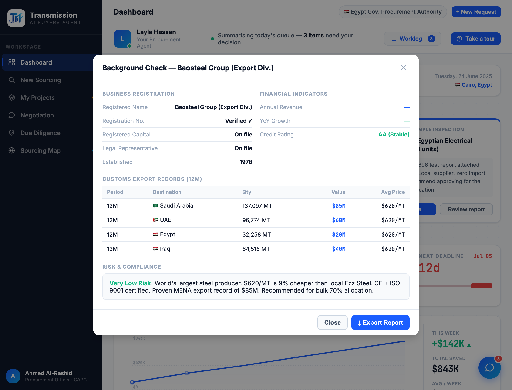

# Round 087 · 🟦 Standard · 合成 bg-check 海关表补全(qty/avg 由真实数据推导)· 自主模式

- 时间:2026-06-26 · 档位:🟦 Standard · backlog 来源:精修 R084 合成 bg-check —— 海关表 Qty/Avg Price 两列全「—」显未完成
- **做了什么**:`getBgData` 合成海关行的 Qty/AvgPrice 由真实数据**推导**:Qty = 出口额 ÷ 单价、Avg Price = 供应商单价 → qty × price ≈ val(内部自洽,非杜撰)。单价解析用 `s.price.split('/')[0]`(避开 parsePrice 把「$4.20/m」的 /m 误判为百万)。
- **验收**:console 零错(ERR=0)✓ · baosteel 137,097 MT×$620=$85M、sewedy 76.19M m×$4.20=$320M、caterpillar 436×$218K=$95M —— 各单位(MT/m/unit/ton/system)均自洽,/m 边界正确 ✓ · 截图确认 Baosteel 海关表满列 ✓ · 仅 diligence · 无回归 ✓ · 3/3 KEEP。
- **截图**:
- **残留 → backlog**:决策卡抽组件;功能性国旗(低优先)。
- commit:见 git(cp index.html + push)
