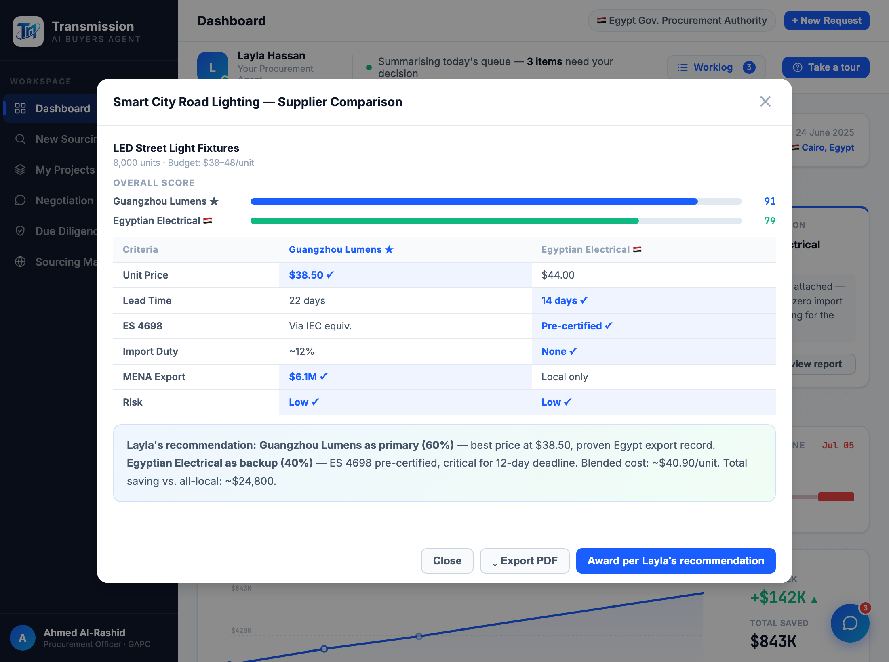

# Round 092 · 🟦 Standard · Compare 模态加「Award per recommendation」决策动作(§4)· 自主模式

- 时间:2026-06-26 · 档位:🟦 Standard · backlog 来源:审计 Compare 模态 —— 给了 Layla 配比建议但只能 Close/Export,无法据此「决策」(违 §4 看→决策)
- **做了什么**:compare 模态 footer 加 **「Award per Layla's recommendation」** 主按钮(Export 降为次按钮):`awardComparison()` 关模态 + worklog 记「Awarded the supply split per Layla's recommendation — drafting the POs」+ toast。买方读完配比建议(Guangzhou 60%/Egyptian 40%)即可一键据此 award。
- **验收**:console 零错(ERR=0)✓ · awardFound=true / 点击关模态 / worklog 6→7 / toast「Awarded per Layla's recommendation…」✓ · 截图确认 3 按钮 footer(Close/Export/Award)清爽不挤、Award 主按钮 ✓ · 无回归 ✓ · 3/3 KEEP(产品:对比建议→可决策 §4 闭环,记 worklog;视觉:3 按钮 footer 清爽;回归:console 零错)。
- **截图**:
- **残留 → backlog**:决策卡抽组件;功能性国旗(低优先)。
- commit:见 git(cp index.html + push)
