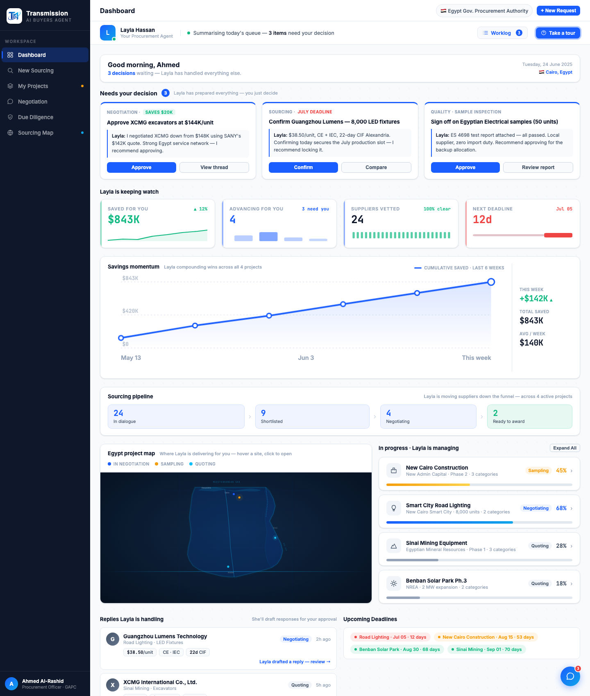
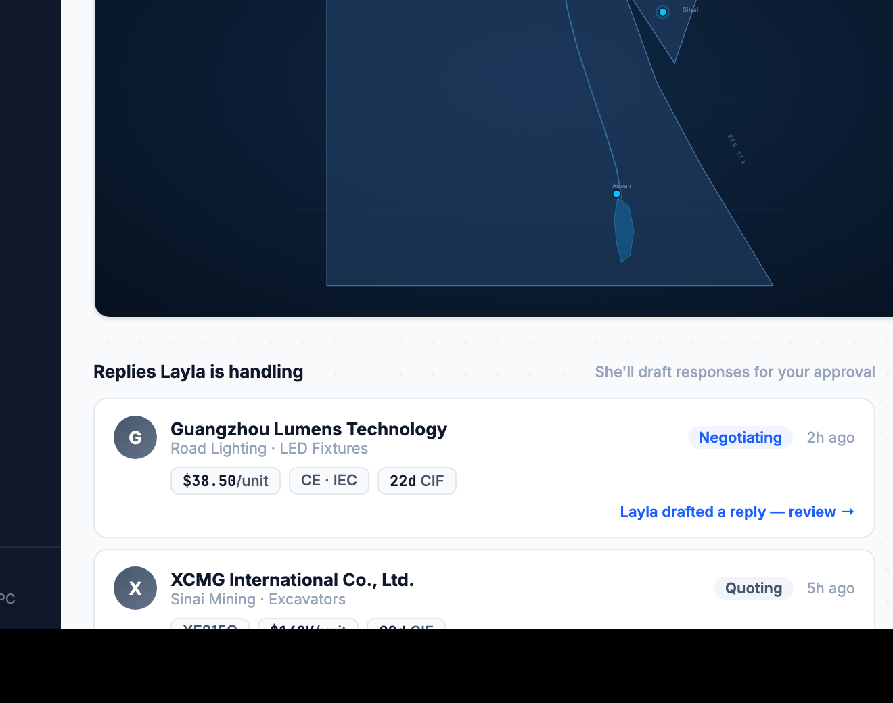

# Round 098 · 🟦 Standard · Egypt 项目地图重做为真实地理 + 去 AI 味 + 交互路由

- 时间:2026-06-26 · 档位:🟦 Standard(单视图 dashboard 组件)· backlog 来源:**用户本轮点名**「地图非常 AI 味很重（Egypt project map 比如这个）」+「地图要有交互感 / 一点点游戏感」
- **做了什么**:
  - **去 AI 味**:删掉 dashboard Egypt 地图的 `radar-scan` 雷达扫描线(R048 加的,本质是「假科技」slop)+ `egGlow` 高斯模糊滤镜 + 那条**手画的抽象 blob 轮廓**(不像真埃及)。同步删掉 Sourcing Map(`.map-wrap`)残留的 `radar-scan` 死 div(CSS 已删)。
  - **真实地理**:用真坐标投影重画**可辨识的埃及轮廓**——地中海岸 + 尼罗河三角洲外凸、**西奈半岛 + 苏伊士湾缺口**、红海斜岸、22°N 直线南境、西部利比亚边界;叠加**尼罗河(阿斯旺→开罗→三角洲分汊)、纳赛尔湖、苏伊士运河**虚线;城市刻度 Cairo/Suez/Aswan + 海域标注 MEDITERRANEAN / RED SEA / Sinai。
  - **交互感 / 游戏感(真实挣来,非假动效)**:4 个项目 pin 按真实地理重定位(Cairo×2 / Sinai / Aswan);新增 **Alexandria · import hub** 端点 + 4 条「项目→亚历山大港」**送货路由线**,默认隐形,**hover pin 或项目行时对应路由点亮 + 货流虚线流动**(`eg-flow`,`prefers-reduced-motion` 关闭),呼应「Where Layla is delivering for you」叙事。pin DOM 顺序 / id 全保留 → R046 双向联动(pin↔列表行)与 click→procurement 不动。
- **验收**:
  - console 零错 ✓(全页 headless sweep 干净)
  - 逻辑自检 ✓:headless 注入跑 `egTip/egLitPin/egTipHide/egRoute` 全 pin → `routes=4 pins=4`,hover p1 正确点亮 `route data-pin=0` + pin idx=0,`errs=0`,联动映射(EG_ID2IDX↔EG_PIN2CARD↔EG_DP2PINIDX)往返一致
  - 跨视图抽查 ✓:改动仅 `.eg-*` / `EG_*`(dashboard)+ 删 sourcing 死 div;Sourcing Map 用独立 `map-*` 类,无重叠
  - 3 critic 两轴:
    - **产品(零负担 + 真人感)**:KEEP —— 送货路由 + 进口港把「Layla 在替你交付」落到可见的真实含义;交互由 hover 触发,非空转。
    - **视觉(高级 / 零 AI 味)**:KEEP —— 去掉雷达扫线 + glow + 假 blob,换成可信指挥中心级真实地图;单一蓝 + 三语义色(非撞色)。
    - **回归**:KEEP —— console 零错,linkage 自检通过,additive。
    - 裁决:**3/3 KEEP**。
- **截图**:  
  - 注:before 用既有 `r047-egmap-before.png`(本轮起手截);after 切图见 `r047-egmap-after-*`(同次渲染裁出)。
- **残留 → backlog**:
  - 用户本轮还点名:**dashboard 一登录信息过载**(R047 已做过一次整合,但用户重申仍过载 → 可做渐进披露 / 降低次级分析区视觉权重 / 折叠);**开场 + 更多科技感 + 更多可视化**;参考 factorygate 补我没有的 component。
  - 两 Cairo pin 距离较近(可接受);可选:pin 端点小标记 / 路由常显极淡基线。
- commit:见 git(cp index.html + push)
