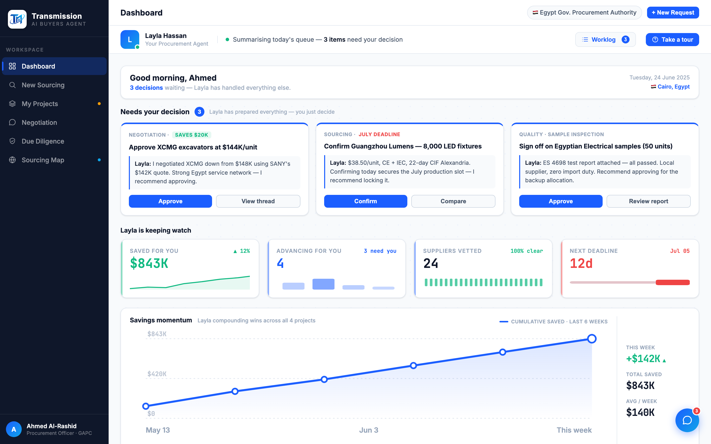
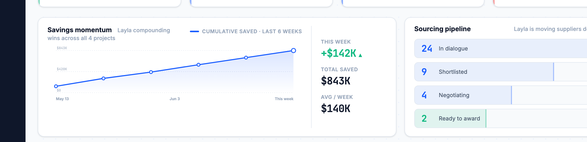
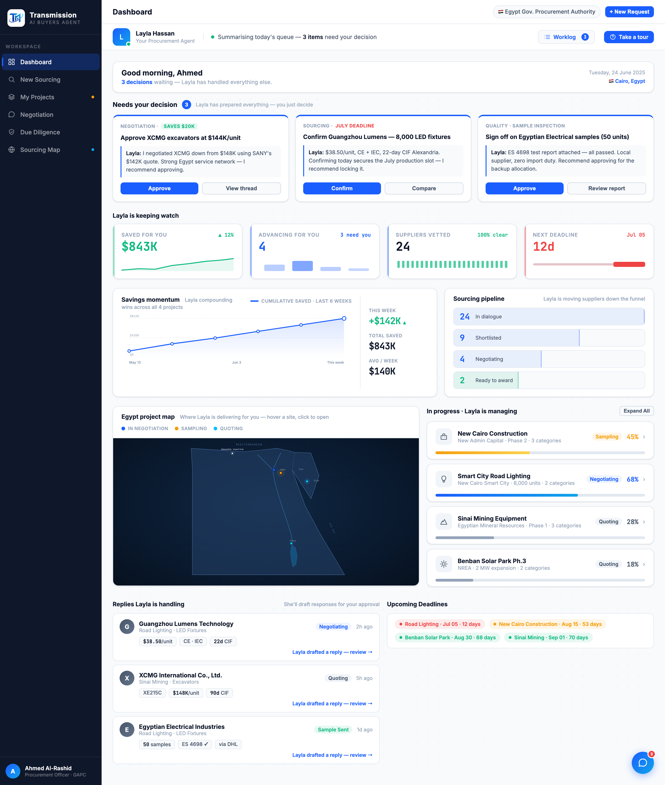

# Round 099 · 🟦 Standard · Dashboard 降信息过载:Savings momentum + Sourcing pipeline 并排 2 栏 + 漏斗竖向可视化

- 时间:2026-06-26 · 档位:🟦 Standard(单视图 dashboard 布局)· backlog 来源:**用户本轮重申**「dashboard 信息密度太高,一登录进来就是信息过载」+「多一些可视化」
- **诊断**:登录首屏后,次级内容是**一长串等宽全幅块逐个堆叠**(决策 hero → KPI 行 → Savings momentum 全幅 → Sourcing pipeline 全幅 → 地图+项目 → Replies+Deadlines),"一面墙"造成过载。但用户**同时要更多可视化** → 解法是**层级/紧凑化,而非删内容**。
- **做了什么**:把两个连续的全幅分析块(`mom-card` Savings momentum + `pipe-card` Sourcing pipeline)包进 `.dash-insights` **2 栏网格**(1.55fr 图 / 1fr 漏斗),从纵向两块压成一行;顺手把原来横向挤的漏斗(`pipe-row`/`pipe-seg` 4 段 + 箭头)重做为**竖向漏斗可视化**(`pipe-fn`/`pf-row`):每级一条轨道 + 按数量递减的填充条(24→100% / 9→66% / 4→46% / 2→34% 绿),数字 mono + 标签常显不截断,`justify-content:space-between` 撑满右栏高度对齐左侧图。`onclick=showView(...)` 全保留。`@media(max-width:1080px)` 回退单栏。
- **效果**:首屏后所有次级内容现在是**一致的 2 栏面板节奏**(momentum|pipeline · 地图|项目 · Replies|Deadlines),页面更短、像真正的分析仪表盘;**可视化不减反增**(漏斗从挤压横条 → 清晰竖向条形图)。
- **验收**:
  - console 零错 ✓(全页 headless sweep 干净)
  - 截图 ✓:2 栏并排渲染正确(图 + 递减填充漏斗),全页节奏一致无破版
  - 跨视图抽查 ✓:改动仅 dashboard `.dash-insights`/`.pf-*` + 漏斗 markup;showView 导航保留;响应式回退
  - 3 critic 两轴:
    - **产品(零负担/真人感)**:KEEP —— 同样内容更有层级,决策仍是 hero,漏斗更易读;无假数据/空转。
    - **视觉(高级/零 AI 味)**:KEEP —— 全幅块墙 → 分析面板节奏,过载下降;单一蓝 + 绿语义,非撞色。
    - **回归**:KEEP —— console 零错,导航保留,additive + 响应式。
    - 裁决:**3/3 KEEP**。
- **截图**:  
- **残留 → backlog**:
  - 旧 `.pipe-row/.pipe-seg/.pipe-arrow` CSS 现已无引用(无害死样式,可后续清)。
  - 用户本轮其余未做完:**开场 + 更多科技感**;参考 factorygate 补缺 component;首屏决策卡仍偏密(可考虑文案/间距进一步呼吸)。
- commit:见 git(cp index.html + push)
