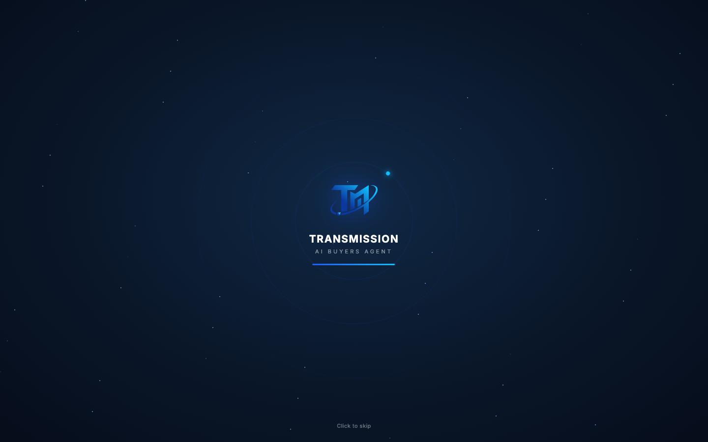
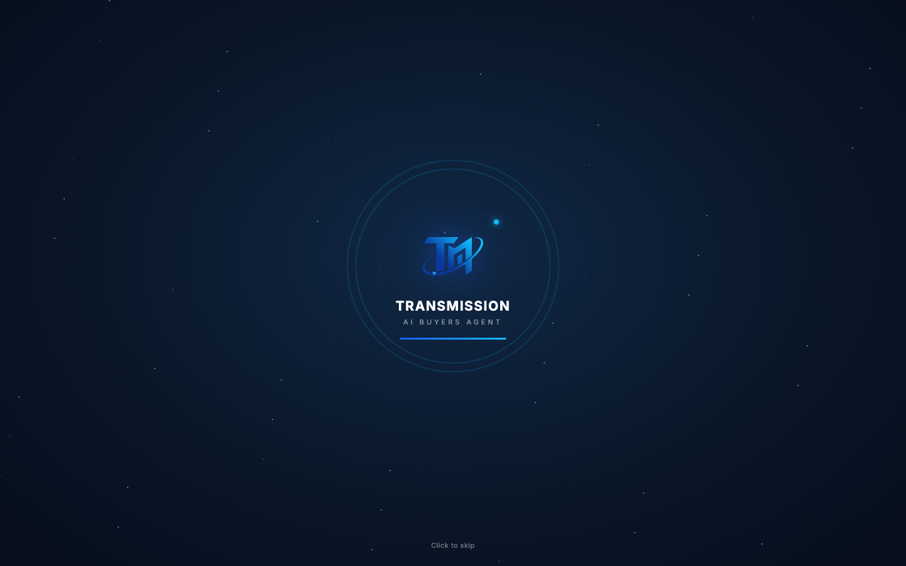
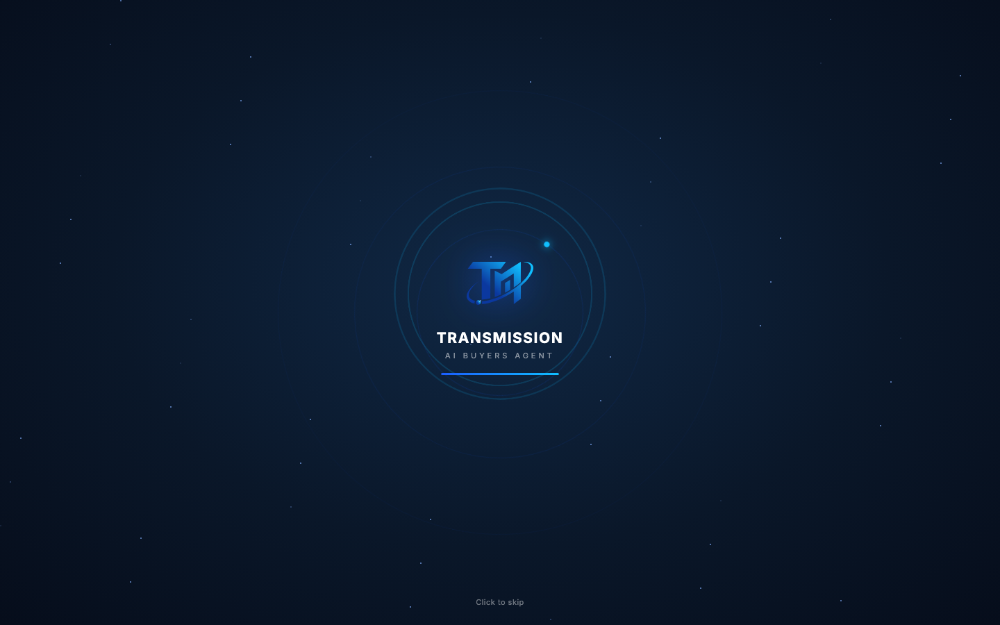

# Round 100 · ⬜ Polish · 开场 splash 加「信号脉冲」环(科技感,借鉴 factorygate)

- 时间:2026-06-26 · 档位:⬜ Polish(开场组件,additive)· backlog 来源:**用户本轮点名**「开场 + 有更多科技感」+「参考 factorygate 加我没有的 component」
- **审计**:现 splash = 星空 + 静态发光 logo + 旋转轨道(很淡)+ 加载条 + Click to skip。已有轨道但**几乎看不见**,整体偏静。factorygate splash 有我没有的 `ringPulse` 同心环 + 快速轨道点。
- **做了什么**:给 splash 加一组**从品牌标向外扩散的「信号脉冲」环**(`.sp-pulse` 3 环,`spPing`:scale .35→4.6 + 淡入即淡出,1.4s 错峰),呈现 logo 持续向外**广播信号**的效果 —— **双关贴合产品名 Transmission(信号/传输)**。signal blue/cyan 实色描边,克制不发光泛滥;`prefers-reduced-motion` 下隐藏。**未引入 factorygate 的 `barFill` 假进度条**(红线:假进度)。既有星空/轨道/logo 入场/加载动画不动。
- **效果**:开场从"静态 logo"变为"有信号在向外脉冲发射"的活态,科技感明显增强且零 slop。
- **验收**:
  - console 零错 ✓(headless sweep 干净)
  - 截图 ✓:两帧(1.7s/2.1s)可见 1–2 圈同心信号环向外扩散 + 轨道点,logo/字标/skip 正常
  - 跨视图抽查 ✓:纯 splash CSS+markup additive,splash→login→app 流程(finish/fade,sessionStorage 门)未动
  - 3 critic 两轴:
    - **产品(零负担/真人感)**:KEEP —— 开场更高级有"信号在传输"的活感;非假工作进度(splash 品牌氛围动效)。
    - **视觉(高级/零 AI 味)**:KEEP —— 信号蓝同心环,克制 on-brand,reduced-motion 安全,无 emoji/撞色。
    - **回归**:KEEP —— console 零错,additive,流程未变。
    - 裁决:**3/3 KEEP**。
- **截图**:  
- **残留 → backlog**:
  - splash 仍保留既有 `sp-bar`/`spLoad` 加载条(splash 场景的进度条,边界可接受;若严格 0 假进度可后续评估替换为 indeterminate 扫描点)。
  - 用户其余未做完:参考 factorygate 补更多缺件;**更多可视化**(下轮可挑一个内容视图加 viz);首屏决策卡仍偏密。
- commit:见 git(cp index.html + push)
