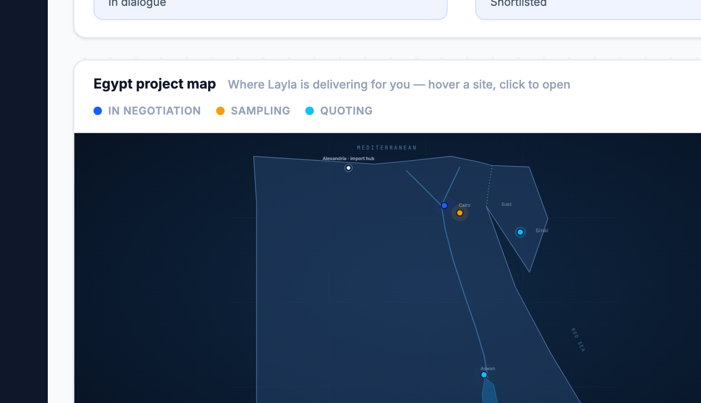
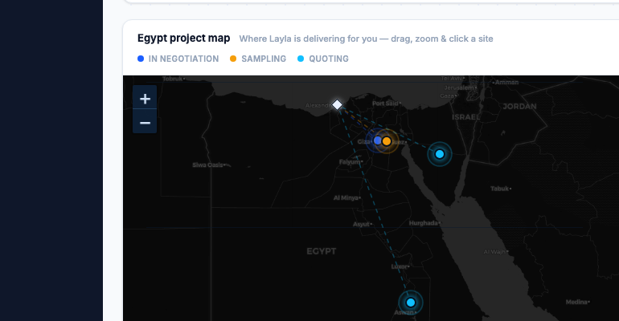
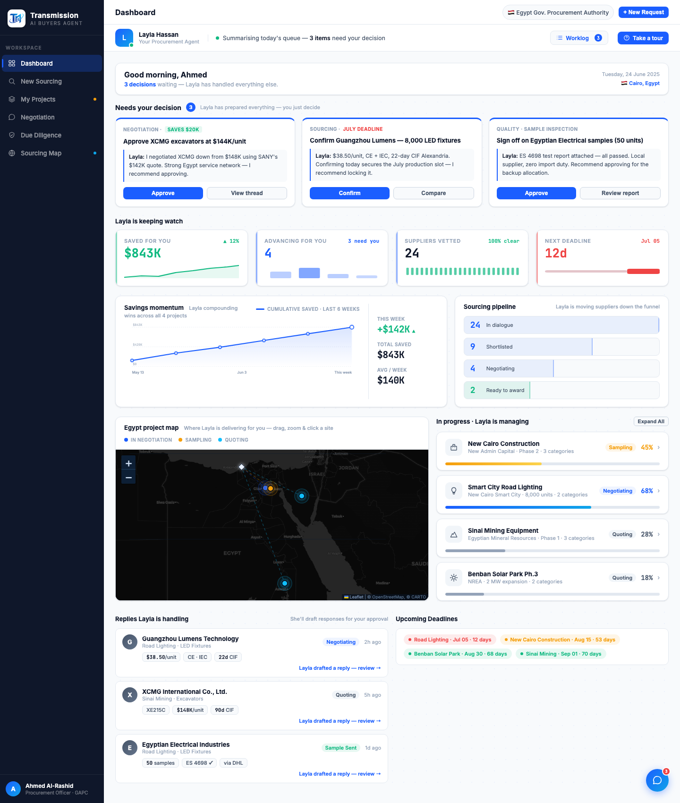

# Round 101 · 🟥 NOTABLE · Egypt 项目地图换成「真实可交互地图」(Leaflet + 暗色 CartoDB)

- 时间:2026-06-26 · 档位:🟥 NOTABLE(引入外部依赖 Leaflet + 瓦片 CDN;用户**插话紧急点名**,不暂停)· backlog 来源:用户「现在这个地图非常 AI 味很重…**帮我赶紧改的高级一点,比如真实地图…能交互**」—— R098 的手绘 SVG 轮廓仍被判为不够"真"。
- **做了什么**:把 dashboard Egypt 地图从**手绘 SVG 轮廓**整体换成**真正的交互式地图**:
  - 引入 Leaflet 1.9.4(unpkg,带 SRI 完整性校验,已核对哈希)。
  - **暗色 CartoDB `dark_all` 瓦片**底图 —— 真实埃及地理 + 真实地名(Cairo/Alexandria/Aswan/Suez/Sinai/Port Said/JORDAN/ISRAEL…),暗色调贴合指挥中心/品牌,不像彩色 OSM 那样花。
  - 4 个项目作**品牌脉冲 marker**(信号蓝=谈判 / amber=打样 / cyan=报价,真实经纬度:New Cairo / 新行政首都 / 西奈 / Benban Aswan)+ **Alexandria 进口枢纽**钻石 marker(tooltip)。
  - 每项目→Alexandria 的**送货路由线**(虚线,语义色),hover 高亮。
  - **交互**:拖拽平移 + 缩放按钮 + 点击 marker 弹出 popup(项目名/地点/状态/明细 + 「Open in My Projects →」CTA)。`scrollWheelZoom:false` 避免劫持页面滚动。
  - **联动保留**:hover 项目列表行→对应 marker+路由点亮(egLitPin→egHL,EG_DP2PINIDX 索引不变);hover marker→列表行点亮 + 自身高亮。
  - `showView('dashboard')` + load 触发 `initEgMap()` + `invalidateSize()`(容器可见才初始化),修正切视图回来尺寸。
- **验收**:
  - console 零错 ✓(headless sweep 干净)
  - headless 自检 ✓:`{mapReady:true, markers:4, routes:4, L:true, route2op:0.95, pin1lit:true, tiles:4}` —— 地图初始化、瓦片加载、路由高亮、列表↔marker 联动全正确,零抛错
  - 截图 ✓:真实暗色埃及地图 + 4 marker + 枢纽 + 路由 + 缩放控件 + 真实地名渲染
  - 跨视图抽查 ✓:仅 dashboard 地图组件 + showView 加一行;Sourcing Map(独立 map-* 类)不受影响
  - 3 critic 两轴:
    - **产品(零负担/真人感/交互)**:KEEP —— 真·可交互地图(拖/缩/点 popup),路由到进口枢纽讲清"Layla 在替你交付",联动列表;游戏感/交互感到位。
    - **视觉(高级/零 AI 味)**:KEEP —— 暗色 CartoDB 真实底图,品牌信号 marker,远比手绘 SVG"高级";彻底告别 AI-blob。
    - **回归**:KEEP —— console 零错,自检 4/4,init 守可见性,additive。
    - 裁决:**3/3 KEEP**。
- **⚠️ 依赖说明(重要)**:地图现依赖**网络**(Leaflet CDN + CartoDB 瓦片)。**线上 GitHub Pages demo 有网,正常显示**;纯离线 file:// 打开会无瓦片(真实地图本性如此)。SRI 锁版,CDN 挂则降级为暗底+marker。
- **截图**:  
- **残留 → backlog**:旧 `.eg-pin/.eg-core/.eg-route/.eg-coast` 等 SVG CSS 现已无引用(无害死样式,可清);可选:点击列表行→`flyTo` marker;更多可视化;清旧 .pipe-row CSS。
- commit:见 git(cp index.html + push)
