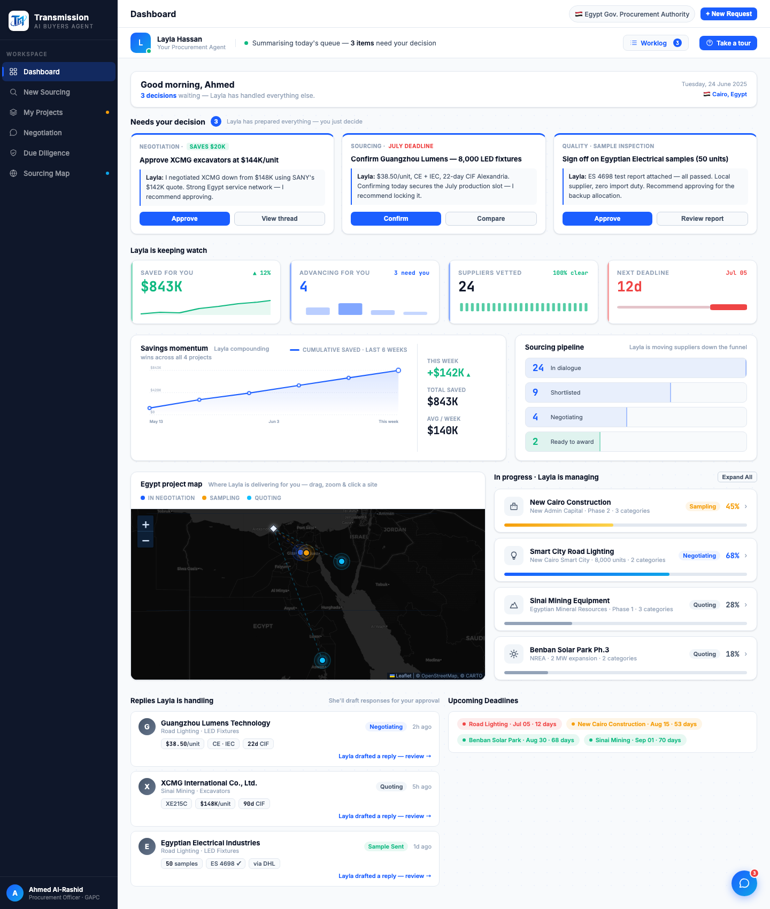

# Round 103 · ⬜ Utility · 清理死 CSS(R099/R101 重写后的遗留)

- 时间:2026-06-26 · 档位:⬜ Utility(纯死代码删除,无视觉变更)· backlog 来源:R101(地图换 Leaflet)+ R099(漏斗重做)后遗留的无引用 CSS
- **做了什么**:删除确认无任何 markup/JS 引用的死样式:
  - 旧 SVG 地图:`.eg-svg / .eg-pin(+:hover/.eg-dim/.eg-lit)/ .eg-core / .eg-pin-pulse / .eg-ring / .eg-route(+.eg-route-on)/ .eg-hub-mark / .eg-coast / .eg-tip(+.show)` + `@keyframes egPulse` + `@keyframes egFlow` + `.eg-flow` + 其 reduced-motion 规则。
  - 旧横向漏斗:`.pipe-row / .pipe-seg(+:hover/.pv/.pl/.pipe-win/.pipe-win .pv)/ .pipe-arrow(+svg)`。
  - **保留**仍在用的:`.eg-mk/.eg-hub-ic/.eg-row-lit/.eg-tt/.egpop*`(新地图)、`.pipe-card/.pf-*`(新漏斗)、`.eg-card/.eg-head/.eg-title/.eg-legend/.eg-map-wrap`、`.eg-mk .egp::before` 的 reduced-motion 规则。
- **验收**:
  - 机检 ✓:删除后 15 个死类计数全 = 0;7 个在用类计数 > 0(eg-mk7/eg-hub-ic2/eg-row-lit2/eg-tt3/pipe-card4/pf-row6/pf-content8)
  - console 零错 ✓(headless sweep 干净)
  - 肉眼 ✓:截图 dashboard —— Savings momentum + 竖向漏斗(4 Negotiating/2 Ready to award)+ 真实 Leaflet 地图(marker/路由/缩放/真实地名)+ 项目列表进度条,全部正常,无视觉回归
  - 3 critic:产品 KEEP(无行为变更)· 视觉 KEEP(渲染一致,代码更干净)· 回归 KEEP(死类 0/在用类完好,截图确认)· **3/3 KEEP**
- **截图**:
- **残留 → backlog**:更多可视化 / 科技感 / 参考 factorygate 补缺件 / 首屏决策卡密度。
- commit:见 git(cp index.html + push)
