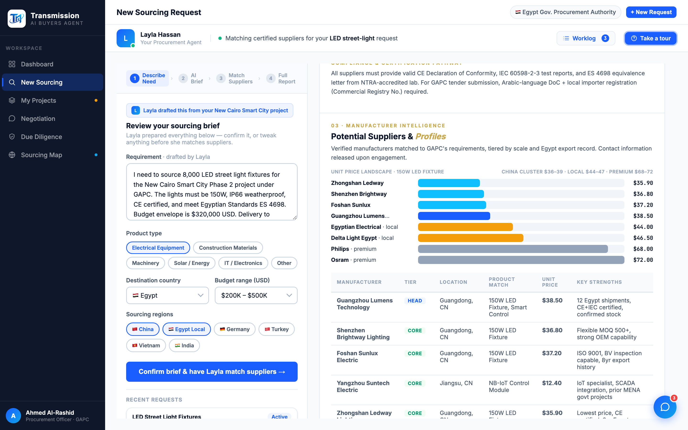

# Round 104 · 🟦 Standard · 寻源报告加「单价对比」条形图(诚实真实数据可视化)

- 时间:2026-06-26 · 档位:🟦 Standard(sourcing 报告 viz,additive)· backlog 来源:用户「更多可视化」+ 内容视图 viz 偏薄
- **诚实性把关**:不造假数据。Diligence 雷达图会需要凭空的 4 维分数(假 %)→ 放弃;改用**寻源报告里已存在的真实单价**(Matched Suppliers 表的 8 家 150W LED fixture 报价)做可视化。
- **做了什么**:在寻源报告「Potential Suppliers & Profiles」表格**上方**加一张**单价对比横条图**(`.sr-pricebars`):8 家按价升序,bar 宽 ∝ 单价(30%→100% 非线性映射,使差异可见同时保真),mono 价标右对齐。语义配色:Layla's pick(Guangzhou $38.50)=品牌蓝 + 「◆ Layla's pick」标;中国 CORE=cyan;Local(Egyptian/Delta)=amber;Premium(Philips/Osram)=slate。caption 标注「China cluster $36–39 · Local $44–47 · Premium $68–72」。
- **效果**:一眼看清价格格局 —— 中国集群紧贴最低价、Layla 的推荐离最低仅差 $2.6 却远低于本地/品牌溢价,直观支撑"为何选它"。纯真实数据,与下方表格价格一致。
- **验收**:
  - console 零错 ✓
  - 截图 ✓:8 条按价升序、宽度比例真实(中国集群短而接近、premium 明显更长)、Layla's pick 高亮、配色语义、mono 价列
  - 跨视图抽查 ✓:仅 sourcing 报告 additive,表格/流程未动
  - 3 critic 两轴:
    - **产品(零负担/决策)**:KEEP —— 价格格局一眼看清,帮买方理解推荐的性价比,支持决策。
    - **视觉(高级/零 AI 味/可视化)**:KEEP —— 干净条形图,单一蓝+语义色,mono 价,on-brand;真实数据非假 %。
    - **回归**:KEEP —— console 零错,additive。
    - 裁决:**3/3 KEEP**。
- **截图**:
- **残留 → backlog**:更多可视化(negotiation 博弈/compare)· 科技感 · factorygate 补缺件 · 首屏决策卡密度(评估后认为卡片本身信息必要,页面级过载已 R099 解决)。
- commit:见 git(cp index.html + push)
