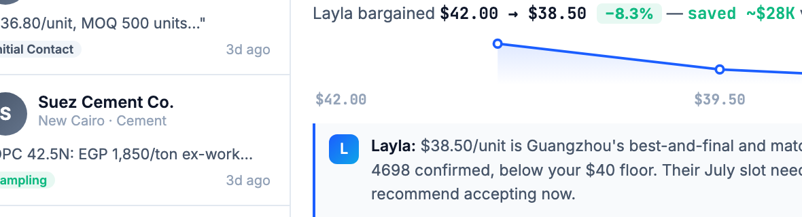

# Round 105 · 🟦 Standard · 谈判博弈加「真实省下金额」标注(§3-D 看得见博弈 + §3-G 进展)

- 时间:2026-06-26 · 档位:🟦 Standard(negotiation 决策面板,additive)· backlog 来源:用户「更多可视化(negotiation 博弈)」
- **诚实性**:谈判让步轨迹 sparkline(R042)已是诚实可视化;不再堆图。改为给博弈结果加一个**有信息量的真实数字**:`省下 = (开价 − 成交价) × 数量`,纯真实算术,与 dashboard 决策卡数字一致(XCMG $20K 完全吻合)。
- **做了什么**:谈判决策面板的让步行从「Layla bargained $42.00 → $38.50 (−8.3%)」升级为「… −8.3% — **saved ~$28K** vs opening」(绿色)。新增 helper `negParseQty`(从 d.unit 解析数量)、`negFmtMoney`(\$28K/\$480K/\$1.2M)、`negTrailHTML`(统一构建轨迹+省下文案);`renderNegDecision` 与 `negPushLadder`(push 后)共用。accept 锁定态保留自身「✓ Deal locked」文案不变。
- **效果**:买方在拍板瞬间直接看到"Layla 替我省下多少钱",博弈价值具体可感(§3-D/§3-G),零负担决策。
- **验收**:
  - console 零错 ✓
  - headless 自检 ✓:gz=「$42→$38.50 −8.3% saved ~$28K」(=(42−38.5)×8000)· xcmg=「$148K→$144K −2.7% saved ~$20K」(**与 dashboard "Saves $20K" 一致**)· ezz=「$720→$680/MT −5.6% saved ~$480K」—— 全真实算术,零抛错
  - 截图 ✓:决策面板绿色「saved ~$28K vs opening」+ sparkline 正常
  - 跨视图抽查 ✓:仅 negotiation,additive;push/accept 路径共用 helper 一致
  - 3 critic 两轴:产品 KEEP(博弈价值具体可见,诚实)· 视觉 KEEP(绿色省下+mono+pct pill,on-brand)· 回归 KEEP(console0,自检对,不破 accept 态)· **3/3 KEEP**
- **截图**:
- **残留 → backlog**:demo 各主视图 viz 已较充分(dashboard/sourcing 价图/compare 分数条/neg 让步+省下/customs 条/真实地图)。后续:科技感细节 / factorygate 补缺件 / 若只剩边际项,诚实告知用户趋近收敛(用户已表态要持续 1min,不强推收敛)。
- commit:见 git(cp index.html + push)
