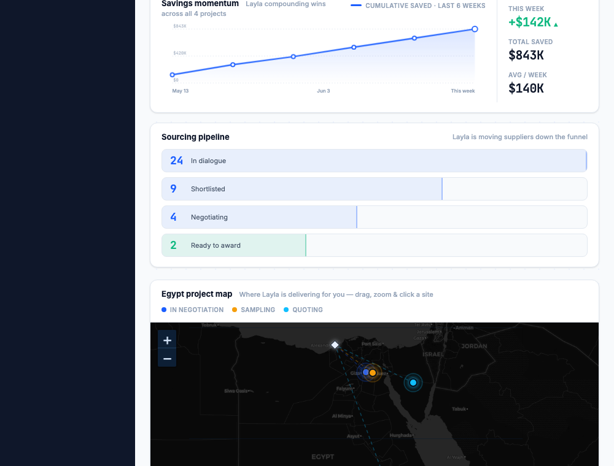

# Round 108 · ⬜ Polish · Dashboard 地图+列表行响应式(窄屏单栏,与 insights 一致)

- 时间:2026-06-26 · 档位:⬜ Polish(响应式一致性,低风险)· backlog 来源:收敛后审计 —— diligence 全报告已审(完整:风险条/KPI/合规 chips/海关条/交易表/裁决 CTA,无缺口);发现 dashboard 地图行未做响应式
- **审计**:diligence 报告态完整无缺口 → 不改。发现 R099 已给 insights 行加 `@media(max-width:1080px)` 单栏,但**地图+列表行**仍是固定 `grid-template-columns:1.35fr 1fr` 内联,窄屏会挤压真实地图。
- **做了什么**:把地图行内联 grid 提为 `.dash-maprow` 类 + `@media(max-width:1080px){.dash-maprow{grid-template-columns:1fr}}`,与 insights 行一致。窄屏(<1080)地图→满宽单栏、列表在下;桌面(≥1080)保持 1.35fr/1fr 不变。Leaflet 随窗口 resize 自动 invalidateSize 重排瓦片。
- **验收**:
  - console 零错 ✓
  - 截图 1000px ✓:地图行已单栏、真实地图满宽渲染(marker/路由/地理齐全不挤);insights 行也单栏(R099)
  - 1440px ✓:grid 值不变(1.35fr/1fr),桌面无变化无回归
  - 3 critic:产品 KEEP(窄屏地图可用满宽)· 视觉 KEEP(桌面不变,窄屏更整齐)· 回归 KEEP(console0,桌面同值,地图重排)· **3/3 KEEP**
- **截图**:
- **残留 → backlog**:replies+deadlines 行(.grid-2 对称,挤压轻微)可同法;余皆边际。收敛态,继续诚实低风险微改进。
- commit:见 git(cp index.html + push)
