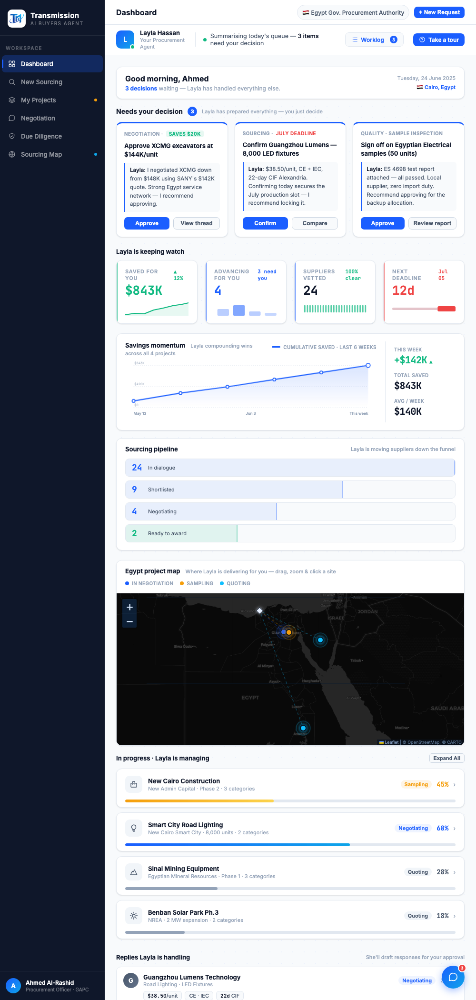

# Round 109 · ⬜ Polish · Dashboard Replies+Deadlines 行响应式(收尾响应式一致性)

- 时间:2026-06-26 · 档位:⬜ Polish(响应式一致性收尾,scoped 低风险)· backlog 来源:R099/R108 响应式一致性 —— dashboard 第三个顶层 2 栏行(Replies+Deadlines)尚未响应式
- **范围判断**:Replies+Deadlines 原用全局 `.grid-2`(另 3 处内层表单也用)。**不动全局 `.grid-2`**(避免影响表单);改为给这一 dashboard 顶层行单独 scoped 类 `.dash-rd`(桌面 1fr/1fr 与原 grid-2 完全一致 + `@media(max-width:1080px)` 单栏),与 `.dash-insights`(R099)、`.dash-maprow`(R108)同模式。
- **做了什么**:dashboard Replies+Deadlines 行 `class="grid-2"`(+inline)→ `class="dash-rd"`;新增 `.dash-rd` CSS。现 dashboard 三个顶层 2 栏行(insights / map+list / replies+deadlines)窄屏统一单栏。
- **验收**:
  - console 零错 ✓
  - 截图 1000px ✓:全 dashboard 顺畅堆叠(决策→KPI→momentum/funnel→满宽地图→项目列表→replies),无破版
  - 桌面 1440 ✓:`.dash-rd` 桌面 CSS 与原 grid-2+inline 同值 → 无变化无回归
  - 3 critic:产品 KEEP(窄屏一致堆叠)· 视觉 KEEP(桌面不变)· 回归 KEEP(console0,scoped 仅此行,桌面同值)· **3/3 KEEP**
- **截图**:
- **★ 响应式一致性收尾**:dashboard 三顶层 2 栏行均已统一响应式。demo 收敛态;后续仅极边际项,继续诚实低风险或如实告知无高价值。
- commit:见 git(cp index.html + push)
