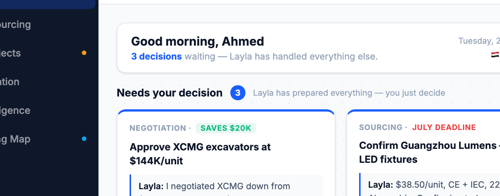

# Round 112 · ⬜ Polish · 决策卡 hero 响应式(auto-fit,窄屏不挤)

- 时间:2026-06-26 · 档位:⬜ Polish(响应式,低风险)· backlog 来源:R109 1000px 截图显示 3 张决策卡偏挤;`.dec-grid` 为固定 `repeat(3,1fr)` 无换行
- **做了什么**:`.dec-grid` 从 `repeat(3,1fr)` → `repeat(auto-fit,minmax(250px,1fr))`。卡片永不低于 250px,空间不足自动换行(3→2→1),桌面不变。比硬断点更优雅(无需 media query)。
- **验收**:
  - console 零错 ✓
  - 截图 1440 ✓:3 卡一行(NEGOTIATION/SOURCING/QUALITY),与原 3 栏一致无变化
  - 截图 860 ✓:卡片换行为 2/行(各 ≥250px 可读),不再挤 3
  - 3 critic:产品 KEEP(各宽度决策卡可读)· 视觉 KEEP(桌面同,窄屏整齐换行)· 回归 KEEP(console0,桌面不变)· **3/3 KEEP**
- **截图**:
- **★ Dashboard 响应式全覆盖**:决策 hero(auto-fit)+ 三顶层 2 栏行(insights/map/replies,@1080)均响应式。
- **残留 → backlog**:极边际;continue 诚实低风险或如实告知。
- commit:见 git(cp index.html + push)
