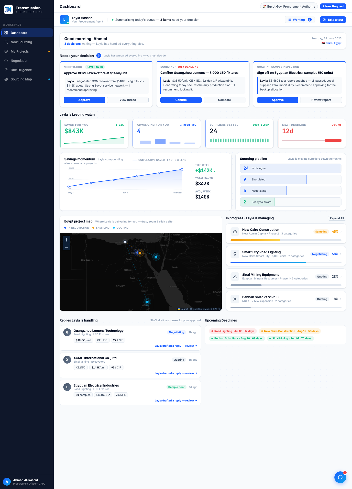
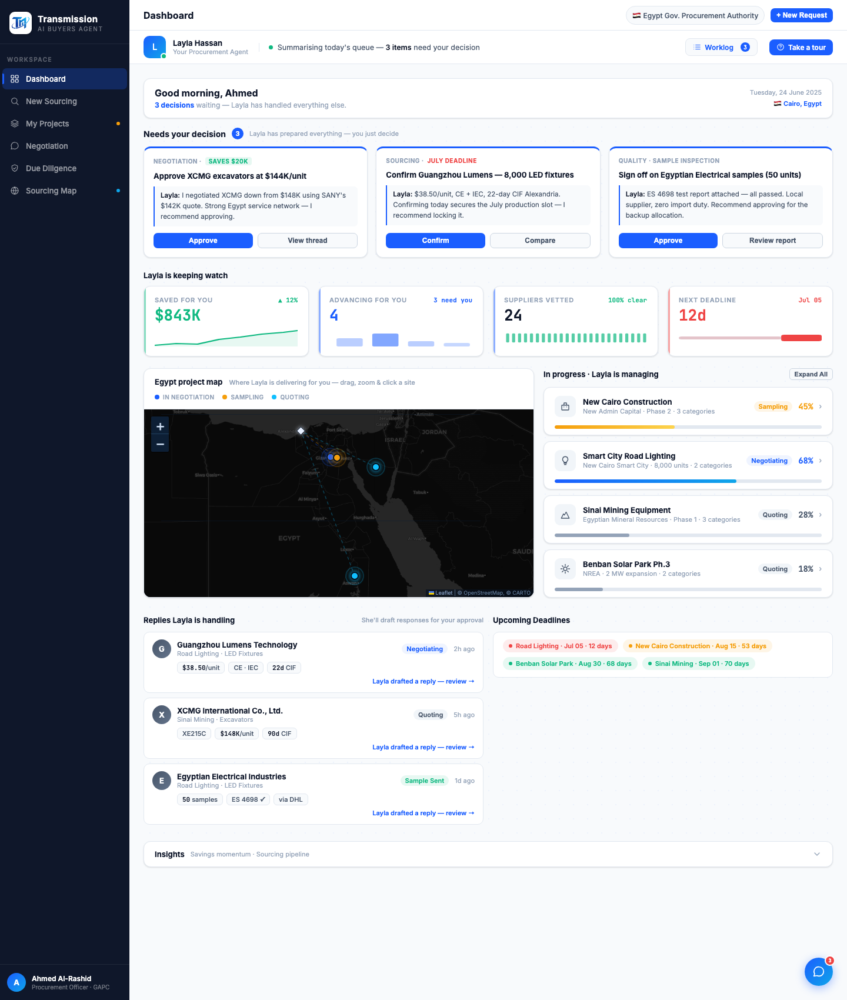
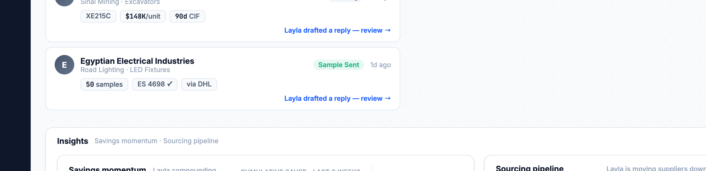

# Round 117 · 🟦 Standard · Dashboard 减负:Insights 分析区折叠到底部(用户点名)

- 时间:2026-06-26 · 档位:🟦 Standard(dashboard 结构,用户新方向)· backlog 来源:**用户问「dashboard 东西是不是太多了?」** → 选定方案「collapse analytics behind a toggle」
- **诊断**:首屏后 5 行 ~9 组件,其中第 3 行两个「概览分析」(Savings momentum 图 + Sourcing pipeline 漏斗)夹在决策与实际工作之间,最"仪表盘味"、最不"决策味";且 momentum 图与「Saved $843K」KPI 重复。
- **做了什么**:把 `.dash-insights`(momentum + pipeline)整块从 KPI 之后**移到 dashboard 最底部**,包进可折叠区 `.dash-collapse`(「Insights」标题栏 + chevron + 副标「Savings momentum · Sourcing pipeline」),**默认折叠**;点击展开/收起(`toggleInsights`,带 aria-expanded)。默认视图流变为:**决策 hero → KPI → 地图+项目 → Replies+Deadlines → ▸Insights(折叠)**。数据零删除,一键可见。
- **效果**:首屏明显减负、决策优先(契合「看→决策」北极星),分析仍在(一键展开)。
- **验收**:
  - console 零错 ✓
  - headless 自检 ✓:`{defaultHidden:true, momInBody:true, funnelInBody:true, afterToggleHidden:false, afterTwoHidden:true}` —— 默认折叠、两分析在内、开/合正常,零抛错
  - 截图 ✓:折叠态 dashboard 更短(决策→KPI→地图→replies→▸Insights);展开态 momentum+funnel 2 栏正常渲染
  - 跨视图抽查 ✓:漏斗 onclick(showView)随块迁移保留;仅 dashboard 结构变动
  - 3 critic 两轴:产品 KEEP(减负、决策优先、数据不丢)· 视觉 KEEP(更清爽、折叠条克制 on-brand)· 回归 KEEP(console0,自检全过,导航保留)· **3/3 KEEP**
- **截图**:  
- **残留 → backlog**:若用户想更激进,可进一步把 KPI 行精简或 momentum 图彻底去掉(与 $843K KPI 重复);本轮按用户所选「折叠」方案。
- commit:见 git(cp index.html + push)
