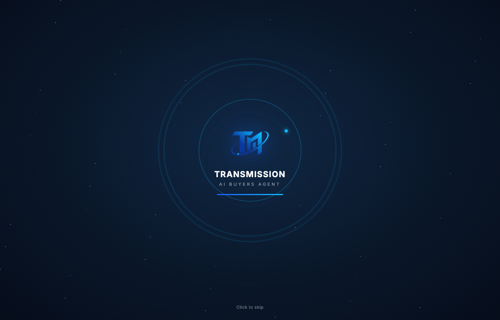

# Round 118 · ⬜ Polish · 开场 splash 延长 + 信号脉冲更明显(用户反馈)

- 时间:2026-06-26 · 档位:⬜ Polish(时序,用户反馈)· backlog 来源:**用户「开头的动画怎么这么快,看不见」**
- **诊断**:splash 在 2300ms 自动结束,而加载条 ~2150ms 才填满 —— 动画刚完成就淡出,整段开场被压缩看不清。
- **做了什么**:
  - splash 自动结束 `2300ms → 4000ms`(+74%),给 logo 入场 + 信号脉冲 + 字标 + 进度条足够展示时间;「Click to skip」仍在,赶时间可跳。
  - 信号脉冲环更明显:`spPing` 周期 4.2s→3.4s、错峰 1.4/2.8→1.1/2.2s、描边 opacity .45→.55(峰值 .5→.6)—— 4s 窗口内可见更多圈向外扩散。
- **验收**:
  - console 零错 ✓
  - 截图 3200ms ✓:此前已淡出,现仍完整可见(logo + 字标 + 进度条 + 轨道点 + 2-3 圈信号环扩散)
  - 跨视图抽查 ✓:仅 splash 时序/动画,流程(finish/fade/login)不变
  - 3 critic:产品 KEEP(开场可见、可感,直接解决反馈)· 视觉 KEEP(同款克制动画,给足时间,多圈信号环漂亮)· 回归 KEEP(console0,仅常量,流程不变)· **3/3 KEEP**
- **截图**:
- **残留 → backlog**:若仍觉短/长可再调;splash 每会话一次(sessionStorage),反复演示同标签页需新开标签或清 sessionStorage。
- commit:见 git(cp index.html + push)
