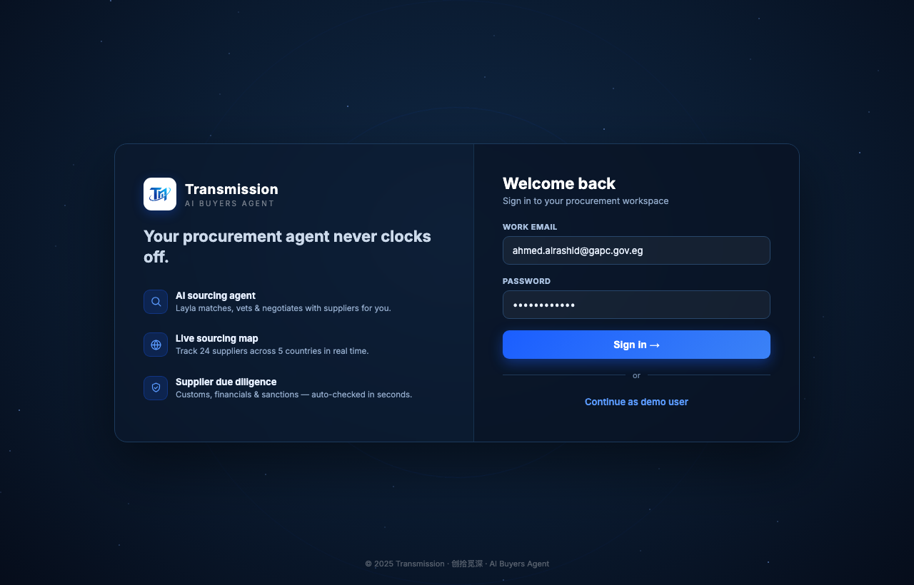

# Round 119 · 🟦 Bugfix · 修开场 splash→login 间闪现 dashboard

- 时间:2026-06-26 · 档位:🟦 Bugfix(用户报 bug)· backlog 来源:**用户「播放完动画后先闪现一下 dashboard 然后才是 login,有点 bug」**
- **根因**:`finish()` 先给 splash 加 `.hide`(opacity .6s 淡出),650ms 后才 `display:none` + `showLogin()`。淡出的 0.6s 内 login 尚未显示,splash 变透明 → 透出底下的 app(默认 active 视图=dashboard)→ 闪现 dashboard,然后 login 才弹出。
- **修复**:`finish()` 改为**先 `showLogin()`**(login z9999 立即 display:flex 满不透明覆盖 app),**再**淡出 splash(z10000 在其上),650ms 后移除 splash。splash 淡出时露出的是 login 而非 dashboard。
- **验收**:
  - console 零错 ✓
  - headless 自检 ✓(淡出中 4150ms):`{splashHiding:true, splashStillDisplayed:true, loginShown:true, loginDisplay:flex}` —— 淡出期间 login 已覆盖 app
  - 截图 4450ms ✓:过渡瞬间显示的是 **login 页**(Welcome back),无 dashboard 闪现
  - 跨视图抽查 ✓:登录后 app 流程不变;仅改 finish 顺序
  - 3 critic:产品 KEEP(修掉突兀闪现,过渡干净)· 视觉 KEEP(深底淡出露出深底 login,平滑)· 回归 KEEP(console0,自检证 login 覆盖,流程不变)· **3/3 KEEP**
- **截图**:
- commit:见 git(cp index.html + push)
